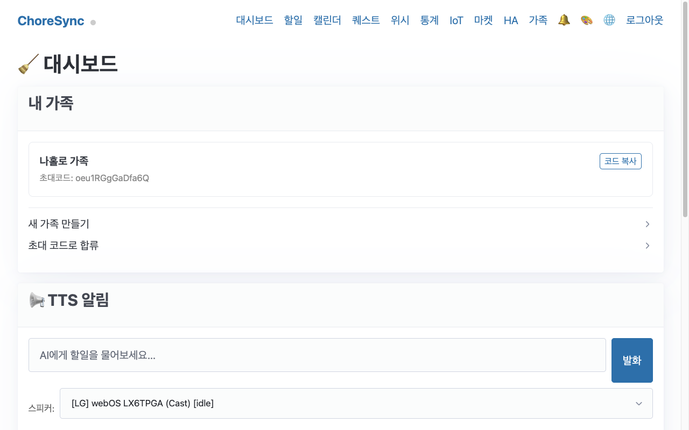
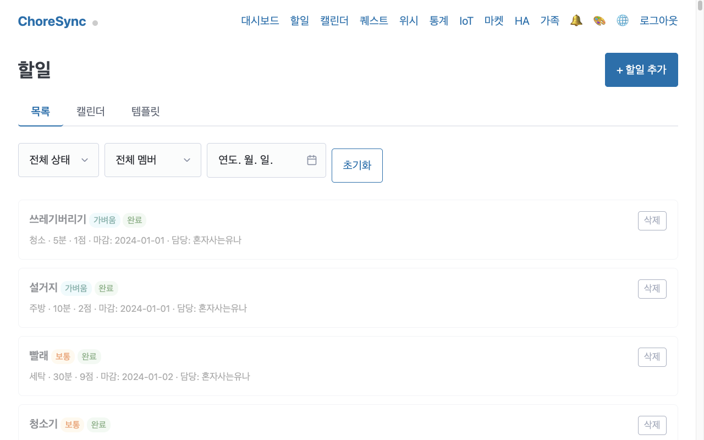
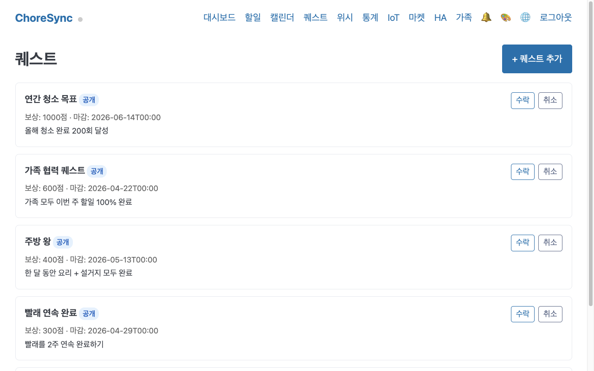
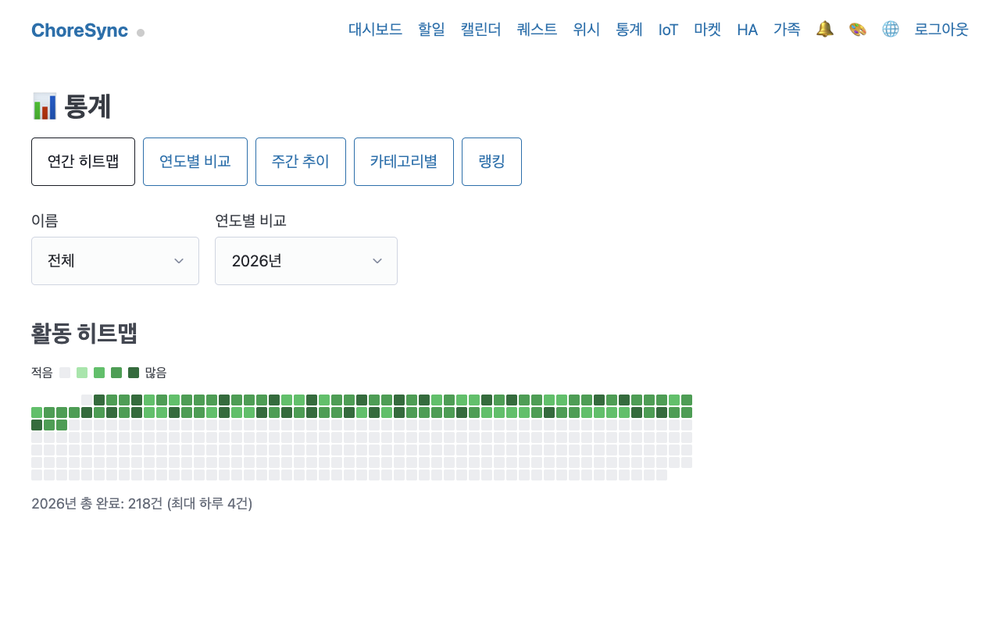
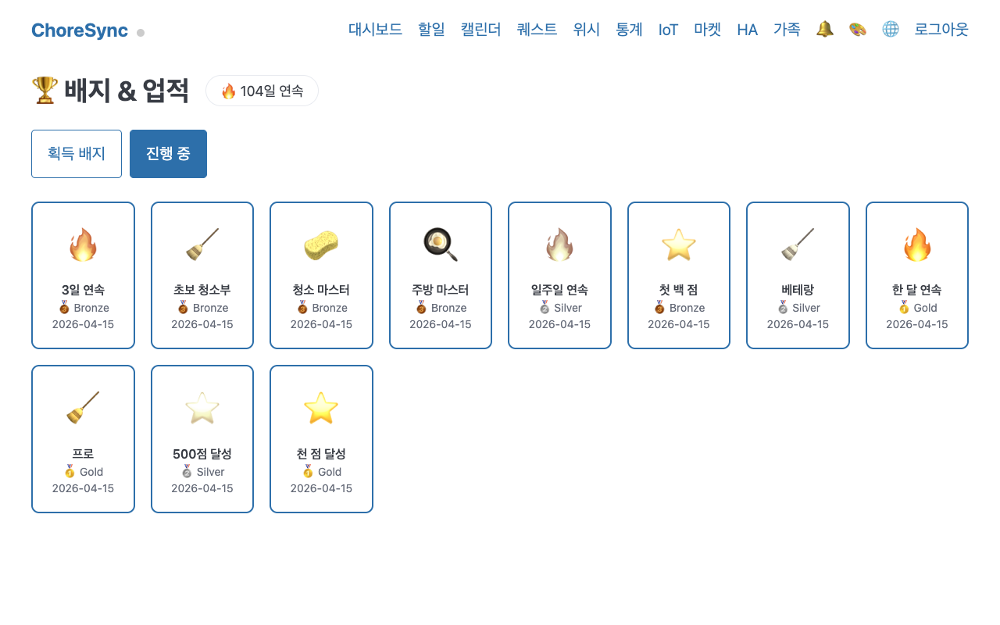

# ChoreSync — Home Assistant 애드온 저장소

가족이 함께하는 집안일 관리 앱을 Home Assistant 애드온으로 제공합니다.

---

## 애드온 목록

| 애드온 | 버전 | 설명 |
|--------|------|------|
| [ChoreSync](choresync/) | v0.9.2 | 가족 집안일 관리 — 할일·퀘스트·포인트·IoT·AI |

---

## 설치

1. Home Assistant → **설정 → 애드온 → 애드온 스토어**
2. 우측 상단 **⋮ → 저장소** 클릭
3. 아래 URL 입력 후 **추가**

```
https://github.com/yunjhl/choresync-ha
```

4. 페이지 새로고침 후 **ChoreSync** 설치

---

## ChoreSync 미리보기

### 대시보드


### 할일 목록


### 퀘스트


### 통계 히트맵


### 배지


---

## 주요 기능

- **할일 관리** — 템플릿 기반 집안일 등록, 담당자 지정, 점수 시스템
- **퀘스트** — 특별 임무 + 보상 포인트로 동기부여
- **위시리스트** — 모은 포인트로 가족 소원 달성
- **가족 레벨** — 함께 올리는 가족 레벨과 12종 업적 배지
- **IoT 연동** — MQTT 트리거로 세탁기·청소기 완료 시 자동 기록
- **TTS 브리핑** — 매일 아침 날씨 + 오늘 할일을 음성으로 안내
- **LLM 챗봇** — "내일 설거지 민준이가 해줘" 같은 자연어로 할일 추가
- **주간 리포트** — 가족 활동 요약과 다음 주 제안
- **캘린더 뷰** — 드래그&드롭 일정 관리
- **PWA** — 모바일 홈 화면에 앱으로 설치 가능

---

## 요구 사항

- Home Assistant OS 또는 Supervised (2023.1 이상 권장)
- 아키텍처: `amd64` / `aarch64`
- 포트 8099 사용 가능

---

## 라이선스

MIT License
